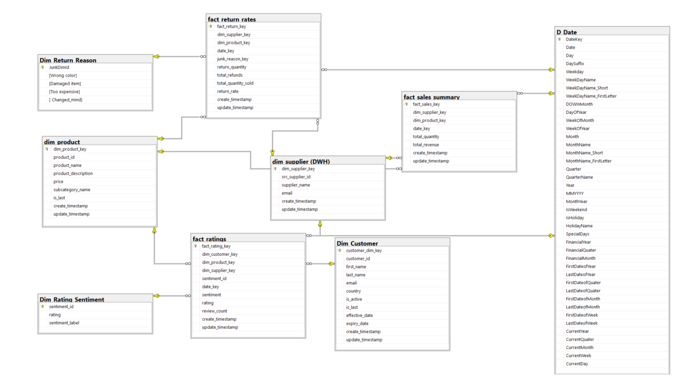

# Supplier Performance Data Warehouse

A data warehousing project designed to analyze supplier performance using sales, returns, and customer ratings data.

The project focuses on supporting data-driven decisions in procurement, quality control, and supplier relationship management by tracking supplier revenue, product return rates, refund amounts, customer satisfaction, and rating trends.

---

## Overview

This data warehouse models supplier performance across three main business areas:

- Sales performance
- Product return rates
- Customer ratings and feedback

The goal is to help identify high-performing suppliers, products with quality issues, common return reasons, and customer satisfaction trends over time.

---

## Business Process

The modeled business process evaluates and improves supplier performance by analyzing:

- Customer satisfaction
- Product return behavior
- Sales performance
- Refund amounts
- Supplier and product quality indicators

These insights can support better procurement decisions, supplier evaluation, and quality control improvements.

---

## Data Warehouse Schema

The following schema shows the dimensional model used in the project, including fact tables, dimension tables, and their relationships.

---

## Dimensional Model

The warehouse uses a dimensional modeling approach with three fact tables and multiple supporting dimension tables.

### Fact Tables

| Fact Table | Description |
|---|---|
| `Fact_sales_summary` | Stores aggregated sales performance by supplier, product, and date |
| `Fact_return_rates` | Stores product return details, refund amounts, and return rates |
| `Fact_ratings` | Stores customer ratings, sentiment, and review counts |

### Dimension Tables

| Dimension Table | Description |
|---|---|
| `Dim_Customer` | Stores customer information and history |
| `Dim_Product` | Stores product details |
| `Dim_Supplier` | Stores supplier information |
| `Dim_Return_Reason` | Stores return reason categories |
| `Dim_Rating_Sentiment` | Stores rating sentiment labels |
| `Dim_Date` | Stores calendar/date attributes for time-based analysis |

---

## Fact Table Grain

| Fact Table | Grain |
|---|---|
| `Fact_sales_summary` | One row per supplier, product, and order date |
| `Fact_return_rates` | One row per supplier, product, return date, and return reason |
| `Fact_ratings` | One row per customer, product, and supplier |

---

## Measures and KPIs

### Sales Summary

Measures:

- Total quantity sold
- Total revenue

Possible insights:

- Highest revenue-generating suppliers
- Top-selling products
- Sales trends by month, quarter, or year
- Average revenue per unit

---

### Return Rates

Measures:

- Return quantity
- Total refunds
- Total quantity sold
- Return rate

Possible insights:

- Suppliers with high return rates
- Products with possible quality issues
- Most frequent return reasons
- Financial impact of returns

---

### Ratings

Measures:

- Rating
- Review count

Possible insights:

- Customer satisfaction per supplier
- Customer satisfaction per product
- Sentiment distribution
- Rating trends over time

---

## ETL Process

The project includes ETL workflows for loading source data into staging tables and then into the final dimensional model.

The ETL process covers:

- Loading dimension tables
- Loading fact tables
- Transforming source data
- Preparing data for analysis
- Handling staging tables
- Deploying and scheduling packages

---

## KPI Queries

The project includes analytical SQL queries for supplier performance evaluation, including:

- Return rate per supplier
- Top return reasons by supplier
- Total sales value per supplier
- Monthly supplier sales performance ranking with market share allocation
- Rating trend over time for each supplier

---

## Tools and Technologies

- SQL Server
- SQL Server Integration Services (SSIS)
- Data Warehousing
- Dimensional Modeling
- ETL Pipelines
- SQL Queries
- KPI Analysis

---

## Project Purpose

This project was developed as a data warehousing academic project to practice designing and implementing a complete analytical solution.

It focuses on supplier performance analysis and shows how data warehousing can support procurement, quality control, and business decision-making.
